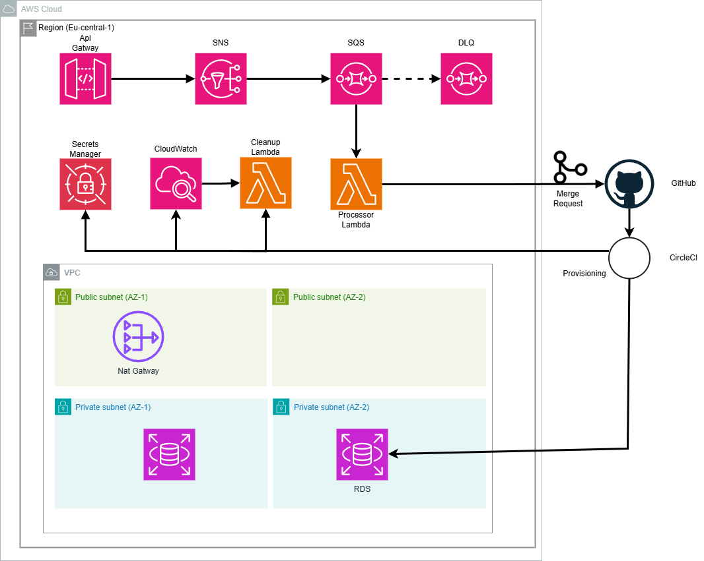

# Serverless RDS Cluster Automation

This project implements an automated solution that allows developers to provision AWS RDS clusters on demand using AWS serverless architecture and Infrastructure as Code (IaC). The entire process is fully automated with CircleCI and requires no manual intervention after deployment.

## Overview

### Architecture



The solution consists of the following components:

1. **API Gateway**: Exposes an endpoint for developers to request RDS clusters.
2. **SNS & SQS**: Ensures reliable and decoupled processing of RDS cluster requests.
3. **Lambda Functions**:
   - **Processor Lambda**: Consumes messages from SQS and creates a pull request in GitHub with Terraform code to provision the RDS cluster.
   - **Auto-Cleanup Lambda**: Identifies and cleans up unused RDS clusters.
4. **Terraform Module**: Defines the RDS cluster configuration.
5. **CircleCI Pipeline**: Automates the deployment of the serverless components and applies Terraform changes.

### Key Features

- **Serverless Architecture**: Utilizes AWS serverless services for cost-effectiveness and scalability.
- **Self-Service for Developers**: Allows developers to request and provision RDS clusters via a simple JSON file.
- **Infrastructure as Code**: All infrastructure is defined using Terraform and AWS SAM templates.
- **Auto-Cleanup**: Automatically identifies and removes unused RDS clusters to reduce costs.
- **API Authentication**: API Gateway endpoints are secured using AWS IAM.
- **GitOps Workflow**: Changes are tracked in Git and applied through pull requests.

## Deployment Instructions

### Prerequisites

- AWS CLI installed and configured with appropriate permissions
- AWS SAM CLI installed
- Terraform CLI installed (version 1.0.0 or later)
- CircleCI account connected to your GitHub repository
- GitHub personal access token with repository access

### Initial Setup

1. **Clone the Repository**:
   ```bash
   git clone https://github.com/omerapp99/serverless-rds-automation.git
   cd serverless-rds-automation
   ```

2. **Set Up GitHub Token**:
   Create a GitHub personal access token with `repo` scope and store it securely.

3. **Configure CircleCI Environment Variables**:
   In your CircleCI project settings, configure the following environment variables:
   - `AWS_ACCESS_KEY_ID`: Your AWS access key ID
   - `AWS_SECRET_ACCESS_KEY`: Your AWS secret access key
   - `AWS_DEFAULT_REGION`: Your preferred AWS region (e.g., eu-central-1)
   - `GITHUB_TOKEN`: Your GitHub personal access token
   - `CUSTOM_DOMAIN_NAME`: Your custom domain name
   - `CUSTOM_DOMAIN_CERTIFICATE_ARN`: Your ACM certifacte ARN
   - `HOSTED_ZONE_ID`: Your Route53 hosted zone id of the domain.
4. **Update AWS Region and Repository Information**:
   - Edit `samconfig.toml` to set your preferred AWS region
   - Update the GitHub repository name in `template.yaml` (look for `GITHUB_REPO` environment variable)

5. **Deploy via CircleCI**:
   Commit and push your changes to the main branch. This will trigger the CircleCI pipeline to deploy the entire infrastructure.

   ```bash
   git add .
   git commit -m "Initial deployment"
   git push origin main
   ```

## Using the Automation

### Requesting a New RDS Cluster

1. **Create a JSON Request**:
   Create a JSON file with the required parameters:

   ```json
   {
     "database_name": "my-application-db",
     "database_engine": "postgresql",
     "environment": "dev"
   }
   ```

   Parameters:
   - `database_name`: Name of your database
   - `database_engine`: Database engine (mysql or postgresql)
   - `environment`: Environment (dev or prod) - determines instance size

2. **Send Request to API Endpoint Using Postman with AWS Authentication**:

   a. Install the AWS Signature Postman extension:
      - Open Postman
      - Go to Settings → Plugins
      - Search for "AWS Signature" and install it

   b. Set up a new request:
      - Create a new POST request to `https://your-api-gateway-url/Prod/rds-request`
      - In the Headers tab, add `Content-Type: application/json`
      - In the Body tab, select "raw" and "JSON", then paste your request JSON

   c. Configure AWS authentication:
      - Go to the Authorization tab
      - Select "AWS Signature" as the type
      - Fill in your AWS credentials:
        * Access Key: Your AWS access key ID
        * Secret Key: Your AWS secret access key
        * AWS Region: Your AWS region (e.g., eu-central-1)
        * Service Name: execute-api

   d. Send the request and note the response with your request ID

3. **Review and Approve the Pull Request**:
   The automation will create a pull request in your GitHub repository. Review the Terraform code and approve/merge it to provision the RDS cluster.

4. **Access Your RDS Instance**:
   Once the CircleCI pipeline completes, your RDS instance will be available. The connection details are stored in AWS Secrets Manager.

### Cleanup of Unused RDS Clusters

The system automatically identifies and cleans up unused RDS instances based on CloudWatch metrics. An RDS instance is considered unused if it has had minimal activity over the past 7 days.

The auto-cleanup process:
1. Creates a final snapshot before deletion
2. Deletes the RDS instance
3. Creates a GitHub PR to remove the Terraform configuration

## Security Best Practices

The solution implements several AWS security best practices:

- **IAM Roles and Policies**: Least privilege access for all components
- **Secrets Management**: Database credentials stored in AWS Secrets Manager
- **API Authentication**: API Gateway secured with AWS IAM
- **Logging and Monitoring**: CloudWatch integration for all components
- **Network Security**: RDS instances deployed in private subnets with security groups

### Logs and Monitoring

- **API Gateway**: Access logs available in CloudWatch
- **Lambda Functions**: Logs available in CloudWatch Logs
- **RDS Instances**: Performance metrics available in CloudWatch Metrics